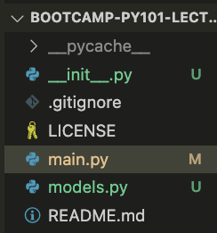

# Setup

Fork the repository from [Solvestack/bootcamp-PY101-lecture-app](https://github.com/SolveStack/bootcamp-PY101-lecture-app).

Navigate to your new repository.

Click the Green Code button and copy the https URL.

In your terminal or Git Bash program, navigate to your code workspace (usually named workspace or git)and run the following commands:

```bash
git clone <copied-link-goes-here>
```

It will look kind of like this:

```bash
git clone https://github.com/<yourusernamehere>/bootcamp-PY101-lecture-app
```

If using Git Bash, it may prompt you to Sign In with your browser. You can follow the prompts to easily sign in.

Otherwise, when asked for a password on the comand line/terminal, you can use your Personal Access Token. [Click here](https://github.com/settings/tokens) to make one in Github if you don't have one.

Then, check out this starting point hash 05cf80aacf086c5595b26d53b400c44e4e450243:

```bash
git checkout 05cf80aacf086c5595b26d53b400c44e4e450243
git switch -c starting-point
```

Refer to the accompanying [terminal output](terminal_output.txt) for example output.

# You're ready to start coding!

Then proceed to add the code to create a Car class definition, and then in main.py, to import your Car model.

Your local repository at the end of class should look like this:



## `__init__.py`
Blank file with no text in it.

## `models.py`

contents:

```python
class Car:
    def __init__(self, make: str, model: str, year: int, tow_required=False) -> None:
        self.make = make
        self.model = model
        self.year = year
        self.tow_required = tow_required
        self.location = "shop" # always starts at the shop
        self.symptoms = []
        self.assignee = None

    def __str__(self) -> str:
        return f"{self.year} {self.make} {self.model}"

    def add_symptom(self, symptom: str):
        self.symptoms.append(symptom)

```

## `main.py`

contents:

```python
from models import Car

if __name__ == "__main__":
    my_car = Car("Jeep", "Wrangler", 2015)
    print(my_car)
    # TODO:
    # 1. instruct user to enter vehicle information
    # 2. Take in make, model, year, if a tow is required
    # 3. Choose an employee to assign to the vehicle
    # 4. Add symptoms to the vehicle based on customer's description
    #    for the technician's understanding
```